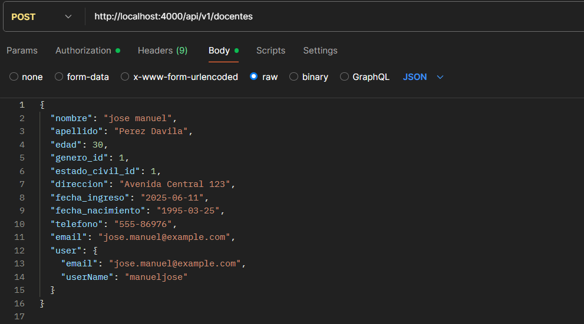
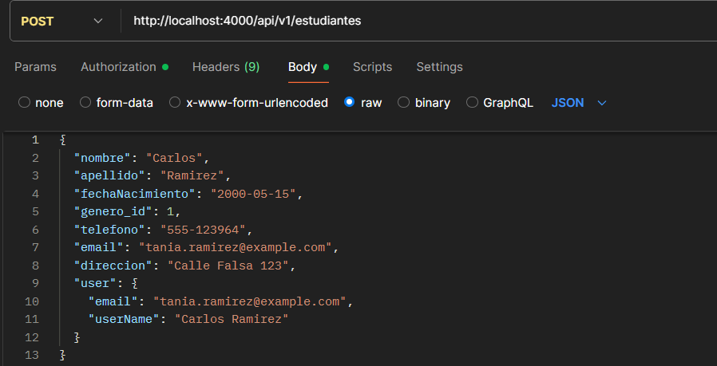
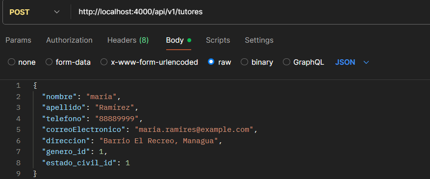
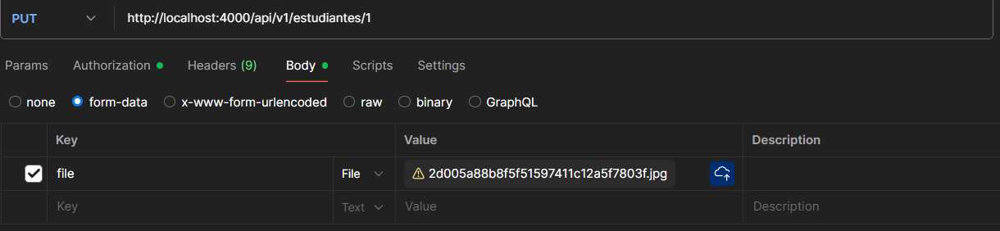
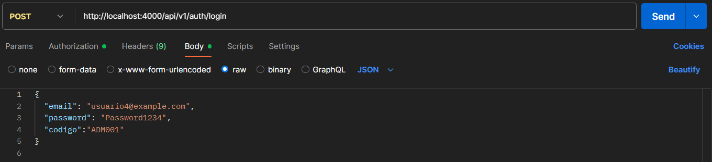
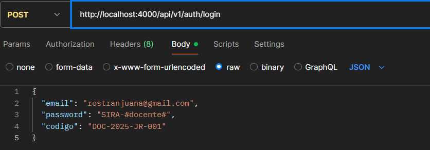
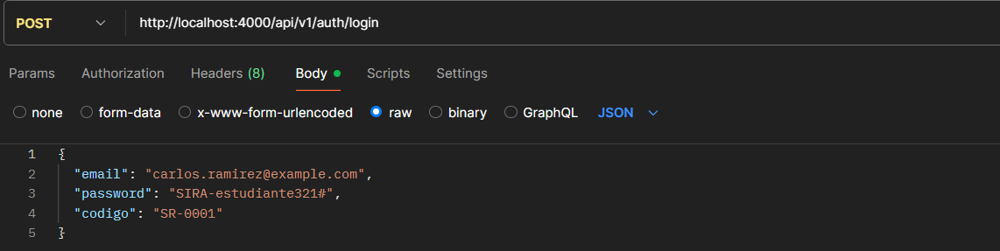
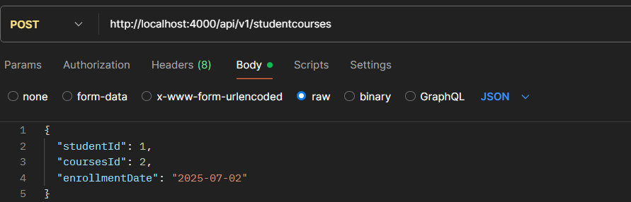
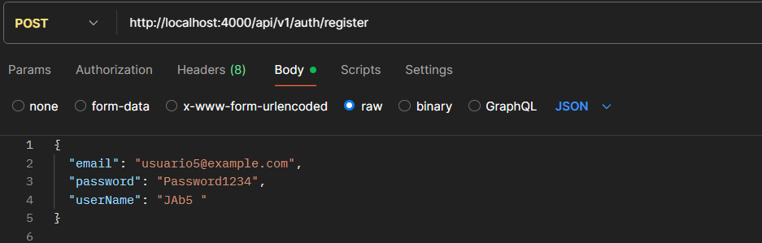
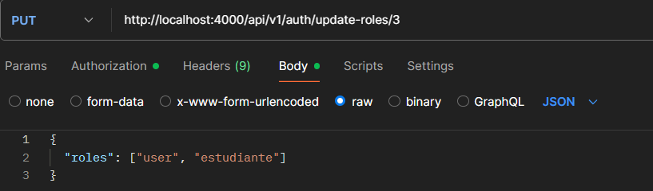

# SIRA - Sistema Integral de Registro Académico


SIRA es un sistema backend desarrollado en **NestJS** que permite la gestión académica de estudiantes, docentes, cursos y reportes. El objetivo es facilitar el registro, consulta y administración de información académica, integrándose con una base de datos **PostgreSQL** y ofreciendo endpoints seguros y documentados.

---

## 🚀 Características

- Gestión de estudiantes, docentes, cursos y tutores.
- Generación de reportes académicos.
- Integración con **PostgreSQL**.
- Endpoints seguros con autenticación JWT/nextAuth-beta.
- Documentación interactiva con Swagger.

---

## 📋 Requisitos Previos

- **Node.js** v18 o superior (se uso node 20.9.0)
- **npm** v9 o superior (10.1.0)
- **PostgreSQL** 15 o superior (usamos la 14)
- **Git** (para clonar el repositorio) (2.49.0)

---

## ⚙️ Instalación y Configuración

1. **Clona el repositorio:**

   ```bash
   git clone https://github.com/Bryan18-Alvarado/SIRA_BACKEND.git
   cd sira-backend
   ```

2. **Instala las dependencias:**

   ```bash
   npm install
   ```

3. **Configura las variables de entorno:**
   Crea un archivo `.env` en la raíz del proyecto con la configuración de tu base de datos y JWT:

   ```env
   DB_HOST=localhost
   DB_PORT=5432
   DB_USERNAME=postgres
   DB_PASSWORD=tu_password
   DB_DATABASE=sira
   JWT_SECRET=tu_jwt_secret
   ```

   **Nota importante:**: asegurate de que el .env este dentro del .gitignore.
   _Este paso es obligatorio para que el sistema funcione correctamente._

4. **Configura la base de datos:**
   Asegúrate de tener PostgreSQL corriendo y una base de datos creada con el nombre especificado en `.env`.

---

## 🚀 Ejecución del Proyecto

- **Modo desarrollo:**

  ```bash
  npm run start:dev
  ```

## 🚀 para crear el usuario admin, necesitas agregar el codigo dentro de la tabla admin, haciendo uso de este insert

INSERT INTO "admin" (codigo_admin, "userId") VALUES ('ADM001', 1);

- **Modo producción:**

  ```bash
  npm run build
  npm run start:prod
  ```

- **Pruebas:**
  ```bash
  npm run test
  ```

---

## 📚 Uso del Sistema

### Endpoints Clave

- **Autenticación:** `POST /auth/login` - Iniciar sesión y obtener token JWT
- **Estudiantes:** `GET /estudiantes` - Listar estudiantes
- **Docentes:** `GET /docentes` - Listar docentes
- **Cursos:** `GET /cursos` - Listar cursos
- **Reportes:** `GET /reportes/estudiantes` - Descargar reporte general de estudiantes
- **Documentación Swagger:** `GET /api` - Acceso a la documentación interactiva


**Nota importante:**: EndPoint para crear un docente desde el postman con su respectivo usuario.
_Este paso es obligatorio para que el sistema funcione correctamente._


**Nota importante:**: Endpoint para crear un estudiante desde postman, funciona igual que docente, pero se diferencia por el tipo de codigo y contrasena inicial


**Nota importante:**: Endpoint para crear un tutor en caso de que el estudiante tenga menos de 18 years o alguna discapacidad desde postman


**Nota importante:** nos permite cargar imagenes a un estudiante desde el backend usando el metodo put desde postman, usando un form data


**Nota importante:**: EndPoint para iniciar sesion en al usuario admin.


**Nota importante:**: EndPoint para iniciar sesion en al usuario docente.


**Nota importante:**: EndPoint para iniciar sesion en al usuario estudiante.


**Nota importante:**: EndPoint de nuestra relacion pivote cursos estudiantes


**Nota importante:**: EndPoint para registrar un usuario


**Nota importante:**: EndPoint para asignar un role a un usuario a traves de un metodo update/put

---

## 🛠️ Tecnologías Usadas

- NestJS
- TypeORM
- PostgreSQL
- ExcelJS
- Swagger
- Jest

---

## 👤 Autores

Desarrollado por [AB Bryan Arauz Alvarado](https://github.com/Bryan18-Alvarado).

Desarrollado por [Katia Julieth Silva Reyes](https://github.com/katia-silva09).

---

© 2025 SIRA - Todos los derechos reservados.
